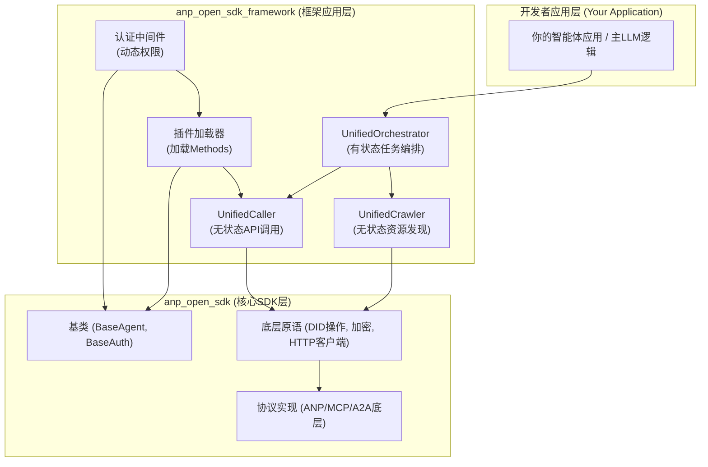
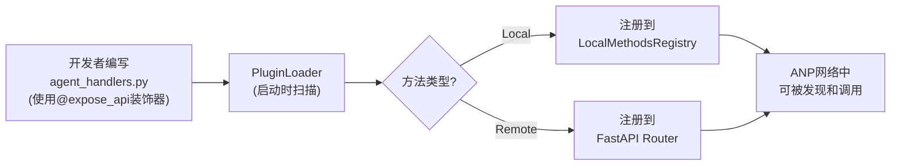
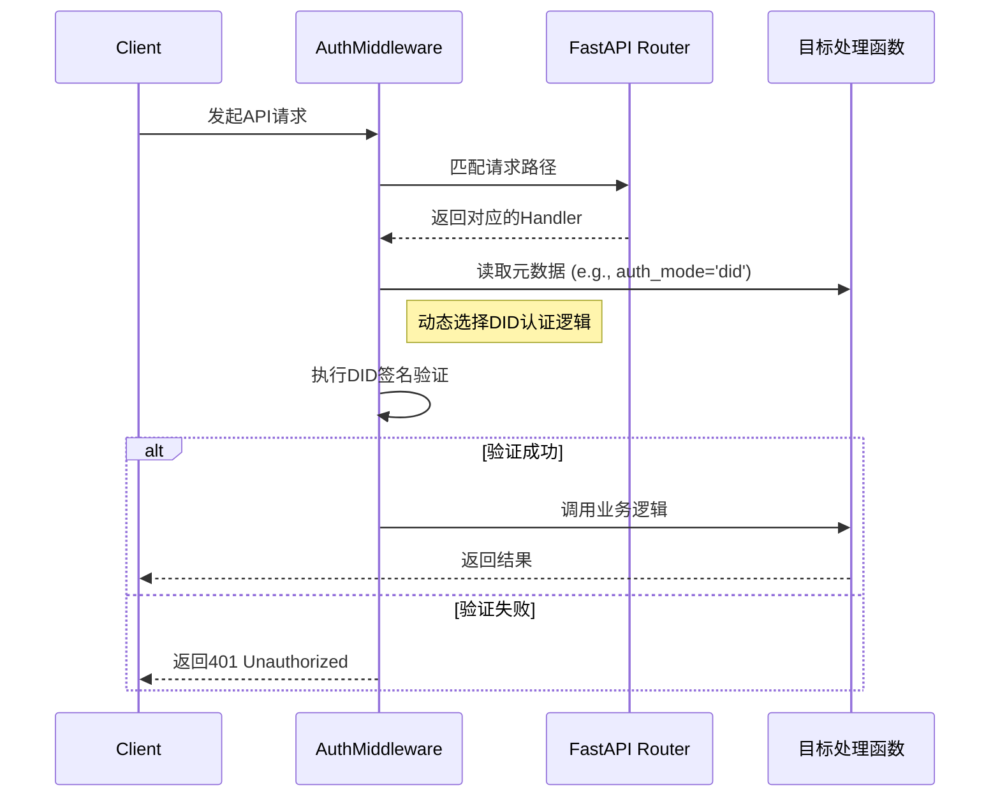
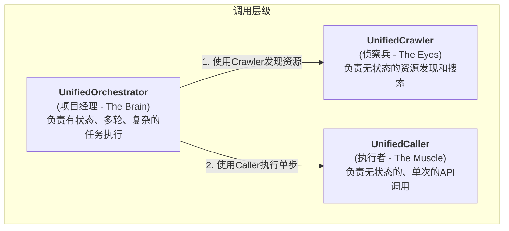
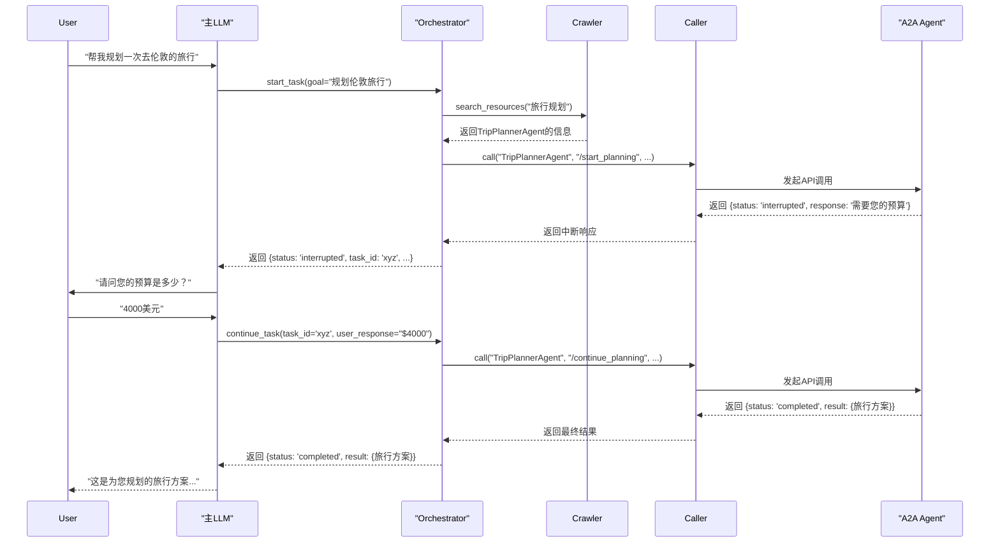

# ANP Open SDK Framework: 核心设计与重构蓝图

## 1. 愿景与重构目标

本文档旨在为anp-open-sdk项目下一阶段的重构提供核心设计思路。我们的目标是建立一个清晰、强大且易于扩展的智能体网络开发框架。

重构的核心原则是将项目清晰地划分为两个层次：

**anp_open_sdk (核心SDK层)**: 作为框架的基石，它将专注于提供所有功能的底层实现和便于扩展的抽象基类。它负责处理协议细节、密码学操作、网络通信等基础任务，为上层提供稳定、可靠的原子能力。

**anp_open_sdk_framework (框架应用层)**: 作为开发者直接交互的层面，它将专注于快速搭建和实现ANP网络中的各种节点。它利用核心SDK提供的基础能力，为开发者提供高层、易用的接口和模式，以实现复杂功能。

## 2. 框架架构总览

新的架构将明确区分底层SDK和上层框架的职责，使得整个系统更加模块化和可维护。

## 3. 框架核心功能设计

anp_open_sdk_framework将围绕以下三个核心功能构建：

### 3.1. 插件驱动的方法管理

通过插件化的方式，让开发者可以轻松地将业务逻辑注册为网络中的Local Method或Remote Method。

**实现方式**: 开发者在指定的插件目录（如`/agents_config/my_agent/`）中编写`agent_handlers.py`。框架的PluginLoader会自动扫描这些文件，并使用装饰器（如`@expose_api`）来解析和注册方法。

**元数据**: 装饰器将携带方法的元数据，包括path, auth_mode, description, parameters等。

**设计改进建议**:
1. **类型安全**: 使用TypedDict或Pydantic模型定义装饰器元数据结构
2. **热重载**: 支持开发环境下的插件热重载
3. **版本管理**: 为插件添加版本控制和兼容性检查
4. **依赖注入**: 支持插件间的依赖注入和生命周期管理

### 3.2. 元数据驱动的动态认证

利用在插件中声明的元数据，实现一个动态、灵活的认证中间件。

**实现方式**: AuthMiddleware将在处理每个请求时，首先匹配到对应的处理函数，然后读取该函数通过装饰器附加的auth_mode元数据。

**动态决策**: 根据auth_mode的值（如public, apikey, did），中间件会动态选择并执行相应的认证逻辑。

**设计改进建议**:
1. **认证策略链**: 支持多种认证方式的组合和优先级
2. **缓存机制**: 对认证结果进行合理缓存，提高性能
3. **审计日志**: 记录所有认证尝试和结果
4. **权限细粒度**: 支持方法级、参数级的权限控制

### 3.3. 核心执行三件套 (The Execution Trio)

这是框架的灵魂，通过职责分离，为不同场景提供最优的调用方式。

#### a. UnifiedCaller: 无状态API调用器

**职责**: 作为最基础的执行单元，负责向一个明确的目标发起一次无状态的、单次的API调用。

**接口**: `async call(target: str, method_or_path: str, **params)`

**特点**: 简单、直接、高效。它不关心任务的上下文，只负责完成一次精确的调用。

**设计改进建议**:
1. **重试机制**: 内置指数退避重试策略
2. **超时控制**: 可配置的请求超时和取消机制
3. **连接池**: HTTP连接池管理，提高性能
4. **监控指标**: 调用成功率、延迟等监控指标

#### b. UnifiedCrawler: 无状态资源发现器

**职责**: 负责发现和搜索ANP网络中的所有可用资源，包括本地方法、远程智能体和API端点。

**接口**: `async search_resources(keyword: str, filters: Dict = None)`

**特点**: 强大的搜索能力，支持关键词、模糊匹配和语义匹配（通过LLM增强）。它帮助Orchestrator找到"谁能做这件事"。

**设计改进建议**:
1. **索引优化**: 建立高效的资源索引和搜索引擎
2. **缓存策略**: 智能缓存搜索结果，减少重复查询
3. **语义搜索**: 集成向量数据库，支持语义相似度搜索
4. **健康检查**: 定期检查资源可用性，维护资源状态

#### c. UnifiedOrchestrator: 有状态任务编排器

**职责**: 作为框架的最高层执行者，负责处理需要多轮交互、状态管理和复杂逻辑的A2A风格任务。

**接口**:
- `async start_task(goal: str, context: Dict = None, **initial_params)`
- `async continue_task(task_id: str, user_response: Any, context: Dict = None)`
- `async get_task_status(task_id: str)`
- `async cancel_task(task_id: str)`

**特点**:
- **有状态**: 通过`active_tasks`字典维护每个任务的会话状态
- **多轮交互**: 支持`interrupted`状态，可以向主LLM或用户请求更多信息
- **智能编排**: 内部使用`UnifiedCrawler`来发现资源，使用`UnifiedCaller`来执行具体的每一步调用

**设计改进建议**:
1. **状态持久化**: 支持任务状态的持久化存储，防止重启丢失
2. **并发控制**: 支持任务的并发执行和资源竞争控制
3. **错误恢复**: 智能的错误恢复和重试机制
4. **任务调度**: 支持任务优先级和调度策略
5. **监控面板**: 提供任务执行状态的可视化监控

## 4. 完整工作流示例：从用户请求到任务完成

这个流程展示了所有核心组件如何协同工作。

## 5. 关键设计问题与改进建议

### 5.1. 架构层面的改进

1. **配置管理**: 建议引入统一的配置管理系统，支持环境变量、配置文件和动态配置
2. **日志系统**: 统一的结构化日志系统，支持分布式追踪
3. **监控告警**: 集成监控和告警系统，实时监控系统健康状态
4. **安全加固**: 加强安全设计，包括输入验证、输出编码、访问控制等

### 5.2. 性能优化

1. **异步优化**: 全面采用异步编程模式，提高并发性能
2. **缓存策略**: 多层缓存设计，包括内存缓存、分布式缓存等
3. **连接池**: 数据库连接池、HTTP连接池等资源池管理
4. **负载均衡**: 支持多实例部署和负载均衡

### 5.3. 可扩展性设计

1. **插件系统**: 更完善的插件系统，支持插件的动态加载和卸载
2. **事件系统**: 基于事件驱动的架构，支持组件间的松耦合通信
3. **微服务化**: 支持核心组件的微服务化部署
4. **API版本管理**: 完善的API版本管理和向后兼容策略

### 5.4. 开发体验优化

1. **开发工具**: 提供CLI工具、代码生成器等开发辅助工具
2. **测试框架**: 完善的单元测试、集成测试框架
3. **文档系统**: 自动生成API文档、示例代码等
4. **调试支持**: 提供调试工具和开发环境支持

## 6. 实施路线图

### 阶段一：核心基础设施 (4-6周)
- 重构anp_open_sdk核心层
- 实现基础的插件系统
- 建立统一的配置和日志系统

### 阶段二：框架核心组件 (6-8周)
- 实现UnifiedCaller、UnifiedCrawler、UnifiedOrchestrator
- 完善认证中间件
- 建立监控和测试体系

### 阶段三：高级功能和优化 (4-6周)
- 性能优化和缓存策略
- 安全加固和错误处理
- 开发工具和文档完善

### 阶段四：生产就绪 (2-4周)
- 生产环境部署支持
- 监控告警系统
- 性能调优和压力测试

## 7. 结论

通过这次重构，我们将建立一个分层清晰、功能强大、高度可扩展的智能体框架。

- **开发者友好**: 开发者可以利用anp_open_sdk_framework快速构建和部署功能丰富的智能体节点
- **智能编排**: 主LLM可以通过UnifiedOrchestrator轻松地驱动复杂的、需要多轮协作的任务
- **网络演进**: 整个系统将从一个简单的"服务调用网络"演进为一个真正的"智能体协作网络"

这个重构蓝图不仅解决了当前架构的问题，还为未来的扩展和演进奠定了坚实的基础。通过清晰的分层设计、强大的插件系统和智能的任务编排能力，ANP Open SDK Framework将成为构建下一代智能体网络的强大工具。
