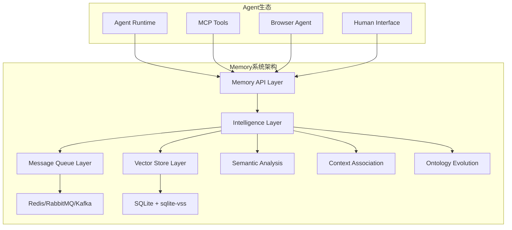

# Memory系统与消息队列对比分析：架构决策

## 🎯 核心问题

Memory系统重新定位为**公共信号量与状态发布点**后，与传统消息队列系统存在功能重合，需要分析：
- 功能重合度有多高？
- Memory系统的独特价值是什么？
- 是否应该基于消息队列构建？
- 如何避免重复建设？

## 📊 功能对比分析

### 功能重合度矩阵

| 功能特性 | Memory系统 | Redis Pub/Sub | RabbitMQ | Apache Kafka | 重合度 |
|---------|------------|---------------|----------|--------------|--------|
| 状态发布/订阅 | ✅ | ✅ | ✅ | ✅ | **高** |
| 信号量管理 | ✅ | ✅ | ✅ | ✅ | **高** |
| 实时通知 | ✅ | ✅ | ✅ | ✅ | **高** |
| 持久化存储 | ✅ | ❌ | ✅ | ✅ | **中** |
| 语义搜索 | ✅ | ❌ | ❌ | ❌ | **低** |
| 向量相似度 | ✅ | ❌ | ❌ | ❌ | **低** |
| 记忆演化 | ✅ | ❌ | ❌ | ❌ | **低** |
| 本体管理 | ✅ | ❌ | ❌ | ❌ | **低** |
| 上下文关联 | ✅ | ❌ | ❌ | ❌ | **低** |
| 时序分析 | ✅ | ❌ | ❌ | ✅ | **中** |

### 详细功能对比

#### 1. Redis Pub/Sub vs Memory系统
```python
# Redis Pub/Sub - 纯消息传递
redis_client.publish("agent_status", json.dumps({
    "agent_id": "agent_001",
    "status": "running",
    "timestamp": time.time()
}))

redis_client.subscribe("agent_status")

# Memory系统 - 智能状态管理
memory.publish_agent_state("agent_001", {
    "status": "running",
    "context": {"task": "processing_documents"},
    "capabilities": ["pdf_processing", "nlp_analysis"],
    "resources": {"cpu": 0.8, "memory": 0.6}
})

# 自动语义关联和历史分析
similar_states = memory.find_similar_historical_states(
    current_state, similarity_threshold=0.8
)
```

**差异点：**
- ✅ **Memory**: 语义理解、上下文关联、历史分析
- ❌ **Redis**: 纯文本消息，无语义理解

#### 2. RabbitMQ vs Memory系统
```python
# RabbitMQ - 基于队列的消息路由
channel.basic_publish(
    exchange='agent_events',
    routing_key='agent.status.update',
    body=json.dumps({"agent_id": "001", "status": "running"})
)

# Memory系统 - 智能信号量管理
memory.set_coordination_signal("task_distribution", {
    "available_agents": ["agent_001", "agent_002"],
    "task_queue_depth": 15,
    "optimal_assignment": {
        "agent_001": ["pdf_tasks"],
        "agent_002": ["image_tasks"]
    }
}, scope="global", intelligence_level="high")

# 自动优化建议
optimization = memory.analyze_coordination_efficiency()
```

**差异点：**
- ✅ **Memory**: 智能分析、优化建议、学习能力
- ❌ **RabbitMQ**: 消息路由，无智能分析

#### 3. Apache Kafka vs Memory系统
```python
# Kafka - 流式事件处理
producer.send('agent-events', {
    'timestamp': time.time(),
    'agent_id': 'agent_001',
    'event_type': 'state_change',
    'data': {'from': 'idle', 'to': 'processing'}
})

# Memory系统 - 事件智能关联
memory.record_agent_event("agent_001", "state_change", {
    "from_state": "idle",
    "to_state": "processing",
    "trigger_context": {
        "task_type": "document_analysis",
        "complexity": "high",
        "deadline": "2024-01-15T10:00:00Z"
    }
})

# 智能模式识别
patterns = memory.discover_agent_behavior_patterns("agent_001")
predictions = memory.predict_resource_needs(patterns)
```

**差异点：**
- ✅ **Memory**: 智能模式识别、预测分析、行为学习
- ❌ **Kafka**: 流处理，无智能分析

## 🏗️ Memory系统的独特价值

### 1. 语义理解能力
```python
class SemanticSignalManager:
    def set_signal(self, signal_name: str, value: dict, semantic_tags: List[str] = None):
        """设置带语义标签的信号"""
        # 生成embedding
        signal_embedding = self.embedding_provider.get_embedding(
            f"{signal_name}: {json.dumps(value)}"
        )
        
        # 存储信号和语义向量
        self.vector_store.add_signal(
            signal_name=signal_name,
            value=value,
            embedding=signal_embedding,
            semantic_tags=semantic_tags or [],
            timestamp=time.time()
        )
        
        # 发现语义相关的历史信号
        related_signals = self.vector_store.find_similar_signals(
            signal_embedding, threshold=0.7
        )
        
        return {
            "signal_id": signal_id,
            "related_signals": related_signals,
            "semantic_insights": self._analyze_semantic_patterns(related_signals)
        }
```

### 2. 上下文关联分析
```python
class ContextualMemoryManager:
    def add_contextual_memory(self, content: str, context: dict):
        """添加带上下文的记忆"""
        # 分析上下文关系
        context_graph = self.build_context_graph(context)
        
        # 关联相关记忆
        related_memories = self.find_contextually_related_memories(context_graph)
        
        # 更新动态本体
        self.ontology_manager.update_concepts(content, context, related_memories)
        
        return {
            "memory_id": memory_id,
            "context_connections": len(related_memories),
            "new_concepts_discovered": self.ontology_manager.get_new_concepts(),
            "relationship_strength": self._calculate_relationship_strength(related_memories)
        }
```

### 3. 智能演化能力
```python
class EvolutionaryMemorySystem:
    def evolve_memory_structure(self):
        """演化记忆结构"""
        # 分析访问模式
        access_patterns = self.analyze_access_patterns()
        
        # 优化向量索引
        self.optimize_vector_index(access_patterns)
        
        # 更新本体结构
        concept_evolution = self.ontology_manager.evolve_concepts(
            usage_data=access_patterns,
            feedback_data=self.get_user_feedback()
        )
        
        # 重组记忆关联
        self.reorganize_memory_associations(concept_evolution)
        
        return {
            "optimization_score": self._calculate_optimization_score(),
            "concept_changes": concept_evolution,
            "performance_improvement": self._measure_performance_gain()
        }
```

## 🔄 架构集成方案

### 方案A：基于消息队列构建（推荐）

#### 分层架构设计
```python
class LayeredMemoryArchitecture:
    def __init__(self):
        # 底层：消息队列基础设施
        self.message_queue = self._setup_message_queue()  # Redis/RabbitMQ
        
        # 中层：Memory智能层
        self.intelligence_layer = MemoryIntelligenceLayer()
        
        # 上层：Memory API层
        self.api_layer = MemoryAPILayer()
    
    def _setup_message_queue(self):
        """设置消息队列基础设施"""
        if self.deployment_scale == "small":
            return RedisPubSubManager()
        elif self.deployment_scale == "medium":
            return RabbitMQManager()
        else:
            return KafkaManager()
    
    async def publish_intelligent_signal(self, signal_name: str, value: dict):
        """发布智能信号"""
        # 1. 消息队列层：实时通知
        await self.message_queue.publish(f"signal:{signal_name}", {
            "signal_name": signal_name,
            "value": value,
            "timestamp": time.time()
        })
        
        # 2. 智能层：语义分析和关联
        intelligence_result = await self.intelligence_layer.process_signal(
            signal_name, value
        )
        
        # 3. 持久化层：向量存储和索引
        memory_id = await self.intelligence_layer.store_signal_memory(
            signal_name, value, intelligence_result
        )
        
        return {
            "immediate_notification": "sent",
            "intelligence_analysis": intelligence_result,
            "memory_id": memory_id
        }
```

#### 组件职责分工
```python
# 消息队列层职责
class MessageQueueLayer:
    """负责：实时通知、负载均衡、故障恢复"""
    def publish_immediate_notification(self, topic, message):
        pass
    
    def subscribe_to_updates(self, topic, callback):
        pass

# Memory智能层职责  
class MemoryIntelligenceLayer:
    """负责：语义分析、上下文关联、智能演化"""
    def analyze_signal_semantics(self, signal_name, value):
        pass
    
    def find_contextual_relationships(self, signal_data):
        pass
    
    def evolve_understanding(self, interaction_history):
        pass

# 持久化层职责
class PersistenceLayer:
    """负责：向量存储、历史记录、本体管理"""
    def store_vector_memory(self, content, embedding, metadata):
        pass
    
    def query_similar_memories(self, query_embedding):
        pass
```

### 方案B：独立系统（不推荐）

#### 完全独立架构
```python
class StandaloneMemorySystem:
    def __init__(self):
        # 重复实现消息队列功能
        self.notification_manager = CustomNotificationSystem()  # 重复轮子
        self.signal_router = CustomSignalRouter()  # 重复轮子
        self.subscription_manager = CustomSubscriptionManager()  # 重复轮子
        
        # Memory独有功能
        self.intelligence_layer = MemoryIntelligenceLayer()
        self.vector_store = VectorStore()
```

**问题：**
- ❌ **重复建设**：重新实现消息队列的基础功能
- ❌ **维护成本高**：需要维护更多自定义组件
- ❌ **生态割裂**：与现有消息队列生态不兼容
- ❌ **性能未优化**：无法利用成熟消息队列的性能优化

### 方案C：混合集成（推荐）

#### 智能适配架构
```python
class HybridMemorySystem:
    def __init__(self, config: dict):
        self.config = config
        
        # 消息队列适配器
        self.mq_adapter = self._create_mq_adapter()
        
        # Memory核心能力
        self.intelligence_core = MemoryIntelligenceCore()
        self.vector_store = VectorStore()
        
    def _create_mq_adapter(self):
        """创建消息队列适配器"""
        mq_type = self.config.get("message_queue_type", "redis")
        
        if mq_type == "redis":
            return RedisAdapter(self.config["redis"])
        elif mq_type == "rabbitmq":
            return RabbitMQAdapter(self.config["rabbitmq"])
        elif mq_type == "kafka":
            return KafkaAdapter(self.config["kafka"])
        else:
            return InMemoryAdapter()  # 轻量级默认实现
    
    async def handle_signal(self, signal_name: str, value: dict, intelligence_level: str = "high"):
        """处理信号的智能级别"""
        
        if intelligence_level == "immediate":
            # 仅消息队列转发
            return await self.mq_adapter.publish(signal_name, value)
        
        elif intelligence_level == "high":
            # 完整智能处理
            # 1. 即时通知
            notification_result = await self.mq_adapter.publish(signal_name, value)
            
            # 2. 智能分析
            analysis_result = await self.intelligence_core.analyze_signal(signal_name, value)
            
            # 3. 向量存储
            memory_result = await self.vector_store.store_semantic_memory(
                signal_name, value, analysis_result.embedding
            )
            
            return {
                "immediate": notification_result,
                "intelligence": analysis_result,
                "memory": memory_result
            }
```

## 🎯 最终架构建议

### 推荐方案：分层混合架构



### 核心设计原则

1. **避免重复建设**：复用成熟消息队列基础设施
2. **突出独特价值**：专注语义理解和智能分析
3. **渐进式架构**：支持从简单到复杂的平滑升级
4. **插件化设计**：支持多种消息队列后端

### 实施路径

```python
# 阶段1：基于Redis的轻量级实现
memory_system = HybridMemorySystem({
    "message_queue_type": "redis",
    "intelligence_level": "medium",
    "vector_store": "sqlite"
})

# 阶段2：增强智能分析
memory_system.upgrade_intelligence({
    "semantic_analysis": True,
    "context_association": True,
    "pattern_recognition": True
})

# 阶段3：企业级扩展
memory_system.scale_up({
    "message_queue_type": "kafka",
    "distributed_vector_store": True,
    "advanced_ontology": True
})
```

## ✅ 结论

**Memory系统与消息队列是互补关系，不是竞争关系**：

- **消息队列**：提供可靠的基础通信设施
- **Memory系统**：在基础设施上增加智能语义层

通过分层混合架构，既避免了重复建设，又充分发挥了Memory系统的独特价值！