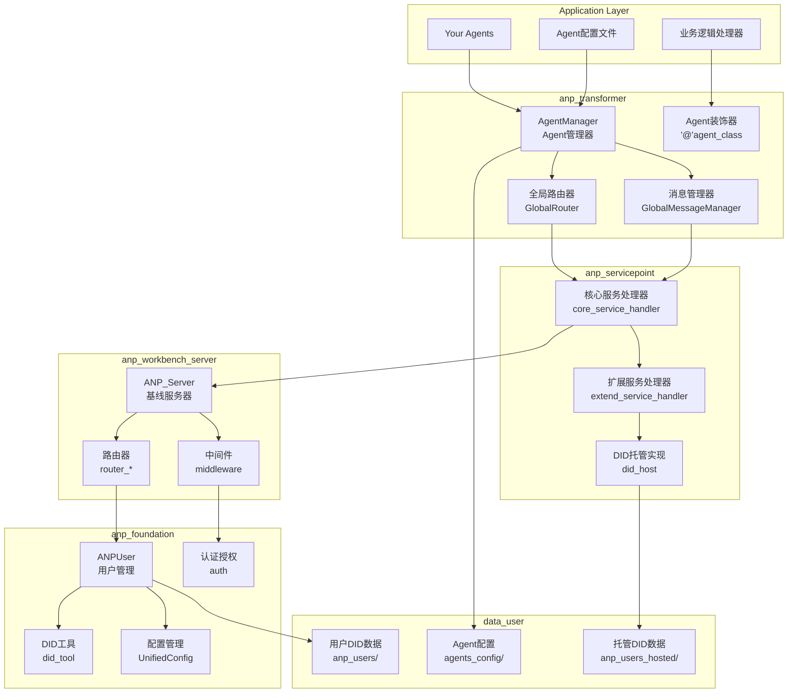
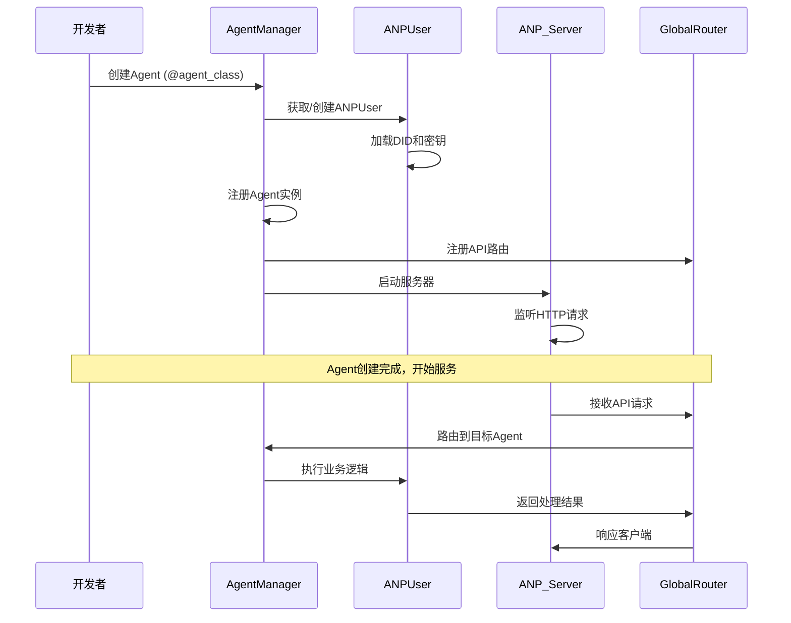
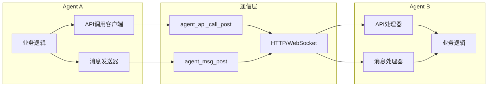
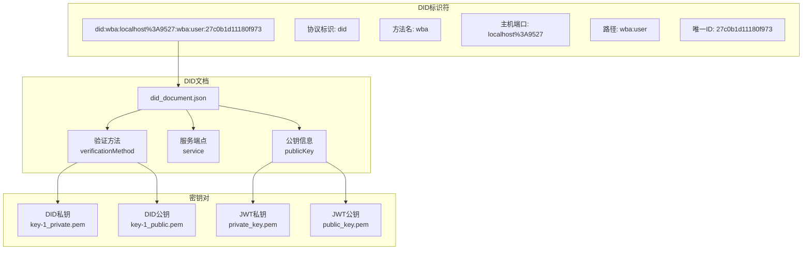
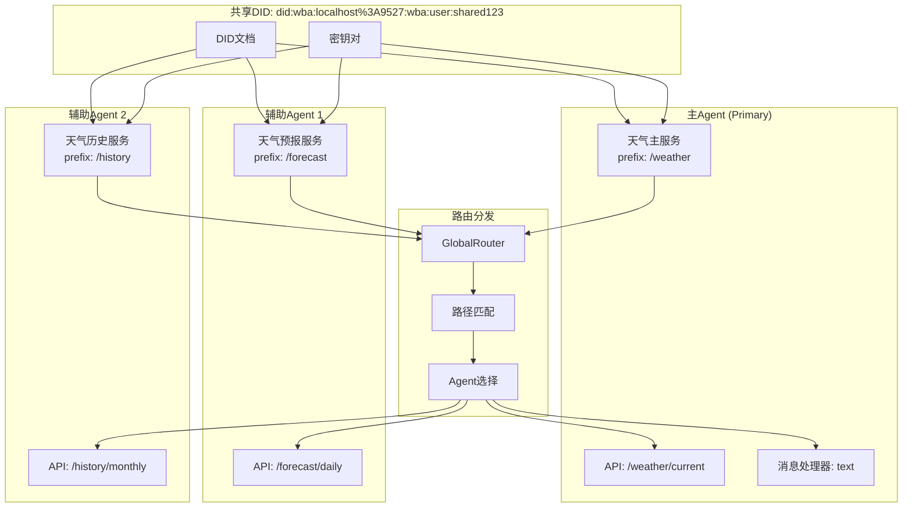
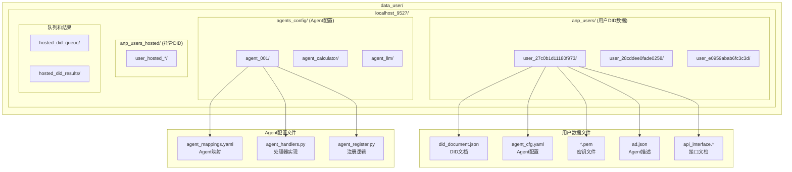
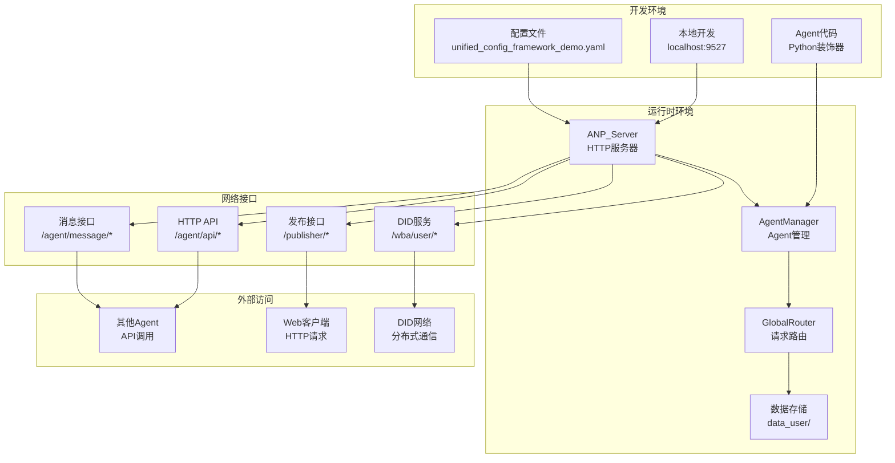
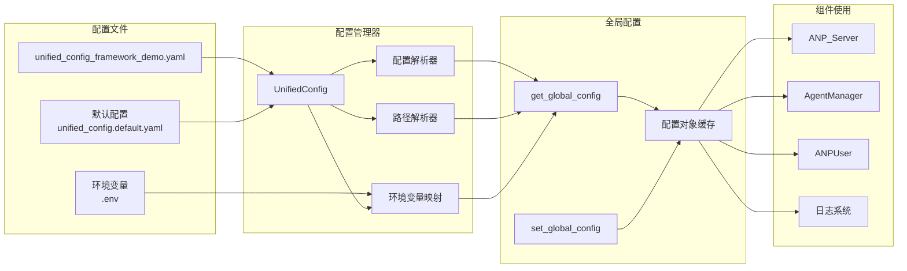
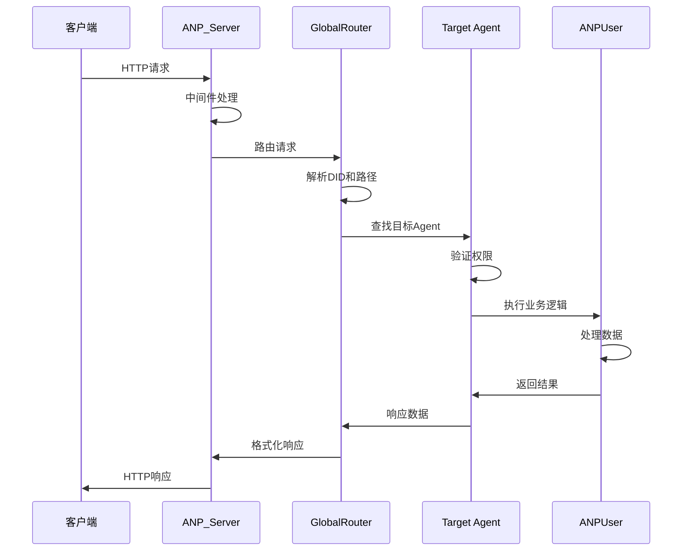
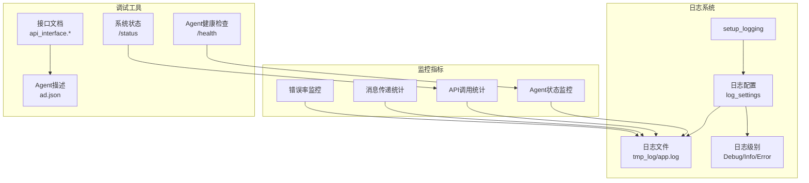

# ANP系统架构图

## 🏗️ 整体架构

## 🔄 Agent生命周期

## 🌐 Agent间通信架构

## 🔐 DID身份架构

## 🔀 共享DID架构

## 📁 数据存储架构

## 🚀 部署架构

## 🔧 配置管理架构

## 🔄 请求处理流程

## 📊 监控和日志架构

---

## 🎯 架构特点

### ✅ 优势

1. **模块化设计**: 清晰的分层架构，职责分离
2. **可扩展性**: 支持动态添加Agent和服务
3. **标准化通信**: 基于DID的统一身份和通信协议
4. **灵活配置**: 支持代码和配置文件两种开发模式
5. **完整生态**: 从开发到部署的完整工具链

### 🔧 核心设计原则

1. **单一职责**: 每个组件专注于特定功能
2. **松耦合**: 组件间通过标准接口通信
3. **高内聚**: 相关功能集中在同一模块
4. **可测试**: 支持单元测试和集成测试
5. **可维护**: 清晰的代码结构和文档

### 🚀 扩展点

1. **自定义Agent**: 通过装饰器或配置文件
2. **服务处理器**: 扩展anp_servicepoint功能
3. **中间件**: 添加认证、限流等功能
4. **存储后端**: 支持不同的数据存储方案
5. **通信协议**: 支持WebSocket、gRPC等协议

---

*架构图最后更新: 2024年1月*
