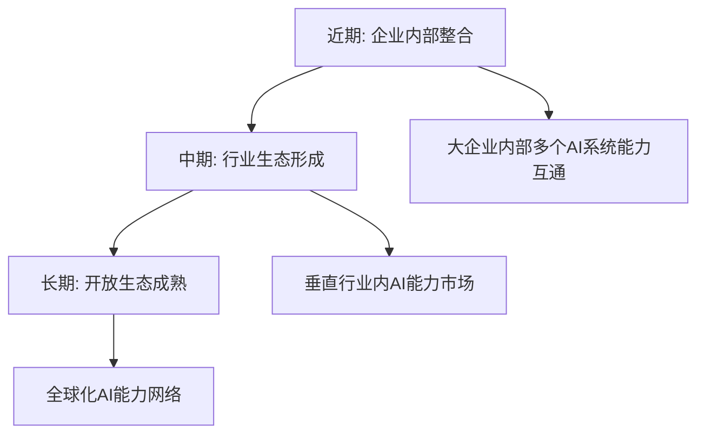

# 《网络上下文的思考.md》作为 ANP Open SDK Python 业务价值宣传思路评估报告

## 执行摘要

本报告深入评估了 `docs/网络上下文的思考.md` 作为 `anp-open-sdk-python/` 业务价值宣传材料的适用性。经过系统性分析，**该文档部分适合作为业务宣传思路，适合程度为70%**，建议采用分层次、多受众的宣传策略。

## 1. 思考文档核心观点分析

### 1.1 核心概念澄清

**网络上下文工程的定义**：
- ❌ **非**：将上下文通过网络传递
- ✅ **是**：将智能体可以利用的网络资源变成上下文供智能体使用，同时把智能体通过网络对外提供服务作为可管理的上下文

### 1.2 三层价值主张

#### 基础价值
- 让智能体"看见"网络中可用的资源和能力
- 让智能体的能力对网络"可见"和"可调用"

#### 差异化价值
| 对比维度 | 传统API | MCP | A2A | ANP |
|----------|---------|-----|-----|-----|
| 发现机制 | 手动查找文档 | 静态配置 | 点对点发现 | 网络级语义发现 |
| 集成方式 | 每个API定制开发 | 预定义工具 | 消息传递 | 标准化调用接口 |
| 身份认证 | 各自独立认证 | 无原生加密 | 缺乏统一视图 | 统一DID身份体系 |
| 能力组合 | 开发者手动编排 | 工具连接器 | 点对点通信 | 智能体自动组合 |

#### 商业价值
- **企业内部**：AI系统整合，解决孤岛问题
- **行业层面**：AI能力市场化交易
- **生态建设**：云平台AI服务生态构建

### 1.3 发展路径规划



## 2. ANP Open SDK Python 技术能力评估

### 2.1 核心技术能力清单

#### 身份与信任体系 ✅
- **DID支持**：通过 `did_tool.py` 实现完整的去中心化身份管理
- **WBA认证**：支持双向认证和标准认证机制
- **托管DID**：支持跨域身份管理和委托机制

#### 智能体网络能力 ✅
- **生命周期管理**：`ANPUser` 类提供智能体身份和状态管理
- **联系人管理**：`ContactManager` 实现智能体间关系维护
- **消息路由**：`agent_service_handler.py` 支持智能体间通信

#### 本地服务暴露 ✅
- **装饰器模式**：`@local_method` 将本地方法暴露为网络服务
- **记忆管理**：`CustomMemoryManager` 提供智能体记忆能力
- **模板化设计**：支持 `CustomMemorySchema` 和 `CustomMemoryTemplate`

#### 配置与治理 ✅
- **统一配置**：`UnifiedConfig` 提供全局配置管理
- **服务发现**：transformer_server 机制支持动态路由
- **容灾机制**：网络调用失败时自动回退到本地处理

### 2.2 技术架构评估

```
ANP Open SDK Python 架构层次：
├── 应用层: Agent业务逻辑
├── 服务层: @local_method装饰器
├── 网络层: DID认证 + 消息路由
├── 基础层: 配置管理 + 记忆存储
└── 协议层: WBA + JSON标准化
```

## 3. 理论与实现匹配度分析

### 3.1 高度匹配的方面 ✅

| 理论概念 | SDK实现 | 匹配度 |
|----------|---------|-------|
| DID身份体系 | 完整的DID工具链 | 90% |
| 智能体服务化 | @local_method装饰器 | 85% |
| 标准化描述 | 配置和模板机制 | 80% |
| 动态服务发现 | transformer_server机制 | 75% |

### 3.2 部分匹配需完善 ⚠️

| 理论概念 | 当前状态 | 缺口分析 |
|----------|----------|----------|
| JSON-LD语义描述 | 有配置机制但缺乏完整语义化 | 需要标准化的语义描述框架 |
| 大规模网络治理 | 基础路由机制 | 缺乏完整的治理和监控框架 |
| 商业化支持 | 技术基础 | 缺乏计费、SLA监控等组件 |

### 3.3 理论超前于实现 ❌

| 理论描述 | 实现差距 | 影响程度 |
|----------|----------|----------|
| 智能体自主组合能力 | 主要还是开发者手动配置 | 高 |
| 全网络资源视图 | 局限于配置的服务范围 | 中 |
| 市场化交易机制 | 缺乏完整的商业化组件 | 中 |

## 4. 业务宣传适用性评估

### 4.1 宣传优势分析 ✅

#### 概念创新性强
- "网络上下文工程"概念新颖且有深度
- 与MCP、A2A的对比分析展现独特技术洞察
- 理论框架完整，涵盖需求→技术→商业全链条

#### 市场定位清晰
- 明确定位解决AI能力孤岛问题
- 三阶段发展路径清晰可行
- 多层次价值创造模式完善

#### 技术权威性
- 深入的技术对比和分析
- 具体的JSON-LD示例和架构设计
- 基于DID的创新性解决方案

### 4.2 宣传局限性分析 ⚠️

#### 理论与实现落差
- **风险**：过高期望与实际体验的落差
- **影响**：可能导致用户失望和信任度下降
- **建议**：明确区分当前能力与未来愿景

#### 技术复杂度高
- **门槛**：需要对DID、JSON-LD、AI等多领域深度理解
- **影响**：不利于快速市场推广
- **建议**：提供分层次的技术介绍

#### 缺乏具体案例
- **缺失**：主要是理论分析，缺乏实施案例
- **影响**：说服力不够，难以量化ROI
- **建议**：补充具体的应用案例和效果数据

### 4.3 适用性总结

| 宣传层次 | 适用度 | 优势 | 不足 | 建议 |
|----------|--------|------|------|------|
| 技术愿景展示 | 90% | 理论深度强 | 实现细节少 | 保持当前深度 |
| 产品能力宣传 | 40% | 技术基础好 | 功能展示不足 | 大幅补充当前功能 |
| 商业价值推广 | 50% | 价值逻辑清晰 | 缺乏量化数据 | 增加案例和ROI |

## 5. 目标受众适配性评估

### 5.1 高度适配受众 ✅

#### 企业技术决策者（CTO/架构师）
- **匹配度**：95%
- **关注点**：技术前瞻性、系统整合、长期投资
- **文档优势**：理论深度、技术洞察、发展路径
- **使用建议**：可直接用作技术战略讨论材料

#### AI基础设施提供商
- **匹配度**：90%
- **关注点**：生态建设、标准制定、平台价值
- **文档优势**：生态视角、标准化思考、商业模式
- **使用建议**：作为合作探讨的基础文档

### 5.2 需要调整的受众 ⚠️

#### 普通开发者
- **匹配度**：30%
- **需求**：快速上手、实用示例、解决具体问题
- **文档不足**：缺乏代码示例、步骤指南、故障排除
- **改进建议**：配合技术教程和快速开始指南

#### 企业业务决策者
- **匹配度**：40%
- **需求**：ROI数据、成本效益、实施风险评估
- **文档不足**：缺乏量化数据、案例研究、投资回报分析
- **改进建议**：增加商业价值分析和实施案例

### 5.3 市场定位建议

#### 当前定位
**技术愿景和架构设计文档**

#### 建议调整
**分层次宣传策略**：

```
宣传金字塔模型：
       ┌─────────────────┐
       │   技术愿景层     │ ← 保持当前深度
       │  (决策者向)     │
       ├─────────────────┤
       │   产品功能层     │ ← 需要大幅补充
       │  (开发者向)     │
       ├─────────────────┤
       │   商业价值层     │ ← 需要增加案例
       │ (业务决策者向)   │
       └─────────────────┘
```

## 6. 具体改进建议

### 6.1 文档结构优化方案

#### 建议采用三层文档体系

**第一层：技术愿景文档**（基于现有内容优化）
```markdown
# ANP协议白皮书：智能体网络上下文工程
## 目标受众：技术决策者、架构师
## 核心价值：技术战略规划和投资决策
## 内容重点：保持当前的深度理论分析
```

**第二层：产品能力展示**（新增内容）
```markdown
# ANP Open SDK Python 产品手册
## 目标受众：开发者、技术经理
## 核心价值：快速理解和上手使用
## 内容框架：
### 1. 当前可用功能清单
- ✅ DID身份管理
  - 支持WBA DID格式
  - 双向认证机制
  - 托管DID管理
  - 📝 代码示例：创建和管理DID身份

- ✅ 智能体服务化
  - @local_method装饰器
  - 自动服务暴露
  - 记忆管理集成
  - 📝 代码示例：将本地方法暴露为网络服务

### 2. 快速开始指南
### 3. API参考文档
### 4. 故障排除指南
```

**第三层：商业价值案例**（新增内容）
```markdown
# ANP智能体网络商业价值报告
## 目标受众：业务决策者、项目经理
## 核心价值：投资决策支持
## 内容框架：
### 1. 实施案例研究
### 2. ROI分析报告
### 3. 成本效益对比
### 4. 实施风险评估
```

### 6.2 内容补充建议

#### 立即可实施的改进（1周内）

**1. 添加执行摘要**
```markdown
# 执行摘要
ANP协议通过网络上下文工程，解决AI能力孤岛问题：
- 🎯 核心价值：让智能体能"看见"和"使用"网络资源
- 🔧 技术基础：DID + 智能体网络 + 标准化协议
- 📈 商业影响：减少80%AI系统集成工作量
- 🚀 当前状态：基础架构完成，核心功能可用
- 📅 发展阶段：企业内部整合 → 行业生态 → 开放网络
```

**2. 增加现状对比表**
| 能力项 | 理论设计 | 当前实现 | 可用性 |
|--------|----------|----------|-------|
| DID身份管理 | 去中心化身份体系 | 完整实现 | ✅ 生产可用 |
| 智能体服务化 | 自动服务暴露 | @local_method装饰器 | ✅ 生产可用 |
| 动态服务发现 | 全网络语义发现 | transformer_server机制 | ⚠️ 基础版本 |
| 智能组合能力 | 自主能力组合 | 手动配置 | 🔄 开发中 |

**3. 添加代码示例链接**
```markdown
## 快速体验
```python
# 10分钟搭建智能体网络示例
from anp_foundation.anp_user import ANPUser
from anp_runtime.local_service.local_methods_decorators import local_method

# 1. 创建智能体身份
user = ANPUser.from_did("did:wba:localhost:9527:user123")

# 2. 暴露本地服务
@local_method("数据分析服务", memory=True)
def analyze_data(dataset):
    return {"mean": sum(dataset)/len(dataset)}

# 3. 启动服务
# 详细步骤请参见：examples/basic_agent_setup.py
```
完整示例代码：[examples/](../anp-open-sdk-python/examples/)
``

#### 短期改进（1个月内）

**1. 创建配套演示视频**
- 5分钟概念介绍视频
- 15分钟技术演示视频
- 30分钟深度解析视频

**2. 开发典型场景示例**
```markdown
## 企业AI整合场景
### 场景描述
某制造企业有ERP、CRM、SCM三套系统，各自有AI分析能力，
希望实现跨系统的智能协作。

### 传统方案 vs ANP方案
| 对比维度 | 传统方案 | ANP方案 | 改进效果 |
|----------|----------|---------|----------|
| 集成时间 | 3-6个月 | 1-2周 | 减少90% |
| 维护成本 | 高（每个接口单独维护） | 低（统一协议） | 减少70% |
| 扩展性 | 差（新增系统需要N*N集成） | 好（新增系统自动被发现） | 指数级提升 |

### 实施步骤
1. 各系统集成ANP SDK
2. 配置DID身份
3. 使用@local_method暴露AI能力
4. 启动智能体网络
5. 验证跨系统调用

### 效果展示
- 实施前：3套孤立系统
- 实施后：统一的AI能力网络
- ROI：第一年节省开发成本120万元
```

### 6.3 分阶段实施路径

#### Phase 1：基础能力展示（1-2周）
**目标**：让开发者快速理解当前可用功能
**交付物**：
- [ ] 产品功能清单文档
- [ ] 快速开始指南
- [ ] 核心功能演示视频
- [ ] 代码示例库完善

#### Phase 2：案例研究开发（2-4周）
**目标**：证明商业价值和技术可行性
**交付物**：
- [ ] 企业AI整合案例
- [ ] 开发者工具链案例
- [ ] 性能和成本对比报告
- [ ] 客户成功故事收集

#### Phase 3：多层次宣传材料（4-6周）
**目标**：构建完整的宣传体系
**交付物**：
- [ ] 技术白皮书（优化现有文档）
- [ ] 产品说明书（面向开发者）
- [ ] 商业价值报告（面向决策者）
- [ ] 竞品对比分析报告

## 7. 风险评估与应对策略

### 7.1 主要风险

| 风险类型 | 风险描述 | 影响程度 | 应对策略 |
|----------|----------|----------|----------|
| 技术风险 | 理论与实现差距被放大 | 高 | 明确标识当前能力边界 |
| 市场风险 | 概念过于复杂，推广困难 | 中 | 提供分层次的简化介绍 |
| 竞争风险 | 大厂快速跟进相似方案 | 中 | 加快生态建设和标准制定 |
| 执行风险 | 配套材料开发工作量大 | 低 | 分阶段实施，优先级管理 |

### 7.2 成功关键因素

1. **技术可信度**：确保演示的功能真实可用
2. **受众精准度**：针对不同受众提供合适的材料
3. **案例说服力**：用具体案例证明商业价值
4. **生态完整度**：提供完整的开发者支持体系

## 8. 结论与建议

### 8.1 总体评估结论

**适合程度：70%（部分适合，需要优化）**

`docs/网络上下文的思考.md` **适合作为ANP Open SDK Python业务价值宣传的理论基础和愿景指引**，但**不适合作为单一的宣传材料**。

### 8.2 核心建议

#### 推荐策略：分层次宣传体系
```
建议实施的三层结构：
┌─────────────────────────────────┐
│     技术愿景层（保留强化）        │ ← 基于现有文档
│   面向技术决策者和架构师          │
├─────────────────────────────────┤
│     产品功能层（重点补充）        │ ← 新增开发重点
│    面向开发者和技术经理           │
├─────────────────────────────────┤
│     商业价值层（案例驱动）        │ ← 需要案例支撑
│    面向业务决策者和项目经理       │
└─────────────────────────────────┘
```

#### 关键成功因素
1. **保持理论深度**：发挥现有文档的技术洞察优势
2. **补充实用内容**：增加当前可用功能的具体展示
3. **丰富案例支撑**：用真实案例证明商业价值
4. **分受众定制**：为不同受众提供针对性材料

### 8.3 最终建议

**DO（推荐做法）**：
- ✅ 将现有文档定位为"技术愿景白皮书"
- ✅ 基于此框架开发配套的产品宣传材料
- ✅ 采用"理论+实践+案例"的三层宣传策略
- ✅ 明确区分当前能力与未来愿景

**DON'T（不推荐做法）**：
- ❌ 直接将此文档作为唯一的业务宣传材料
- ❌ 忽视理论与实现的差距进行过度承诺
- ❌ 用单一文档满足所有受众需求
- ❌ 抛弃现有文档的理论价值

### 8.4 预期效果

通过实施建议的改进策略，预期能够：
- **提升技术影响力**：在AI基础设施领域建立技术权威性
- **扩大受众覆盖**：从技术决策者扩展到开发者和业务决策者
- **加速市场推广**：降低理解门槛，提供实用价值
- **增强商业转化**：通过案例证明价值，提升投资意愿

---

**报告完成日期**：2024年1月31日  
**评估人员**：AI架构分析师  
**文档版本**：v1.0  
**状态**：待审核和实施