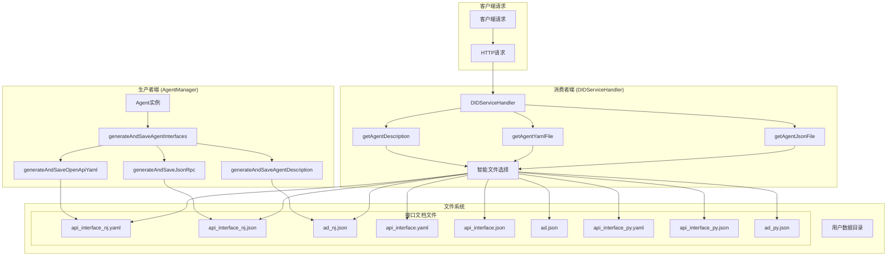
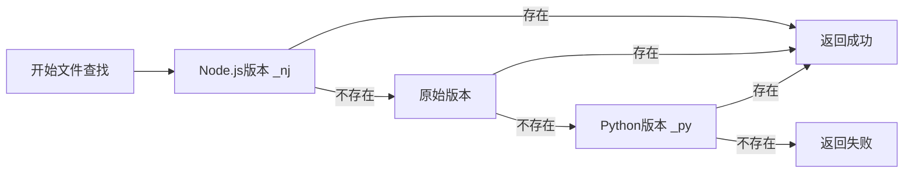
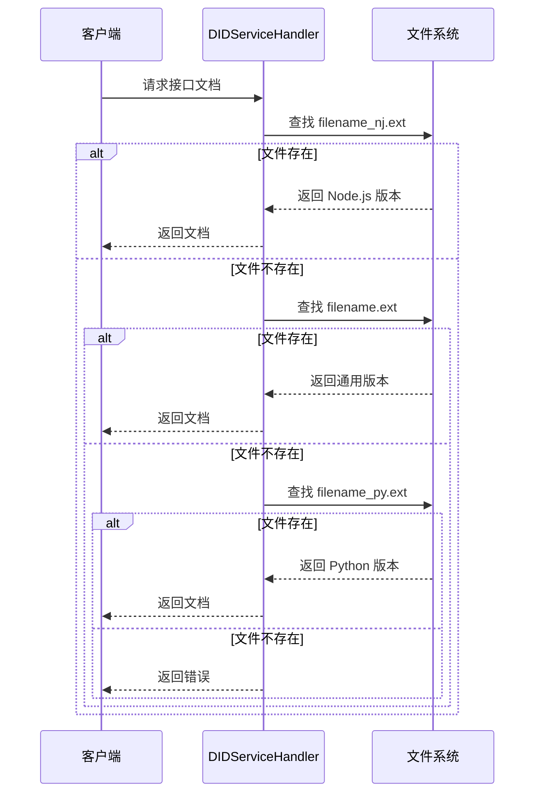

# ANP Open SDK Node.js 自适应接口文档处理机制

## 概述

ANP Open SDK Node.js 版本实现了一套优雅的跨语言自适应接口文档处理机制，通过生产者-消费者模式，确保在多语言环境中的接口文档生成与读取的兼容性。

## 架构设计

### 系统架构图



### 文件优先级策略



## 核心组件详解

### 1. AgentManager - 接口文档生成器

**位置**：`anp-open-sdk-nodejs/src/runtime/core/agent-manager.ts`

**核心方法**：`generateAndSaveAgentInterfaces(agent: Agent)`

#### 关键特性

1. **运行时标识**：所有生成的文档都包含 `runtime: 'nodejs'` 字段
2. **文件命名约定**：使用 `_nj` 后缀区分 Node.js 版本
3. **多格式支持**：生成 YAML、JSON、JSON-RPC 等多种格式

#### 生成的文件类型

| 文件名 | 格式 | 用途 |
|--------|------|------|
| `api_interface_nj.yaml` | YAML | OpenAPI 3.0 规范 |
| `api_interface_nj.json` | JSON | JSON-RPC 2.0 接口 |
| `ad_nj.json` | JSON | Agent 描述文档 |

#### 代码示例

```typescript
// 生成并保存接口文档
static async generateAndSaveAgentInterfaces(agent: Agent): Promise<void> {
  const did = agent.anpUser.id;
  const userDataManager = getUserDataManager();
  const userData = userDataManager.getUserData(did);
  
  if (!userData) {
    logger.error(`无法找到DID '${did}' 的用户数据，无法保存接口文档`);
    return;
  }

  const userFullPath = userData.userDir;

  try {
    // 1. 生成并保存OpenAPI YAML文件（Node.js版本）
    await this.generateAndSaveOpenApiYaml(did, userFullPath);
    
    // 2. 生成并保存JSON-RPC文件（Node.js版本）
    await this.generateAndSaveJsonRpc(did, userFullPath);
    
    // 3. 生成并保存Agent Description文件（Node.js版本）
    await this.generateAndSaveAgentDescription(did, userFullPath);
    
    logger.debug(`✅ 为DID '${did}' 生成接口文档完成`);
  } catch (error) {
    logger.error(`为DID '${did}' 生成接口文档失败: ${error}`);
    throw error;
  }
}
```

### 2. DIDServiceHandler - 智能文件读取器

**位置**：`anp-open-sdk-nodejs/src/servicepoint/handlers/did-service-handler.ts`

**核心方法**：
- `getAgentDescription(userId, host, port)`
- `getAgentYamlFile(respDid, yamlFileName, host, port)`
- `getAgentJsonFile(respDid, jsonFileName, host, port)`

#### 智能文件选择算法

```typescript
// 智能文件选择示例
const fileOptions = [
  `${fileName}_nj.json`,    // Node.js版本优先
  `${fileName}.json`,       // 原始文件作为回退
  `${fileName}_py.json`     // Python版本作为最后回退
];

for (const filename of fileOptions) {
  const filePath = path.join(userFullPath, filename);
  try {
    await fs.access(filePath);
    const fileContent = await fs.readFile(filePath, 'utf-8');
    const data = JSON.parse(fileContent);
    
    logger.debug(`成功读取文件: ${filename}`);
    return { success: true, data };
  } catch (error) {
    logger.debug(`文件 ${filename} 不存在，尝试下一个选项`);
    continue;
  }
}

// 所有选项都失败
return { success: false, error: `文件不存在` };
```

## 自适应机制详解

### 1. 文件命名约定

**格式**：`{base_name}_{runtime_suffix}.{extension}`

| 运行时 | 后缀 | 示例 |
|--------|------|------|
| Node.js | `_nj` | `api_interface_nj.yaml` |
| Python | `_py` | `api_interface_py.yaml` |
| 通用 | 无 | `api_interface.yaml` |

### 2. 运行时元数据标识

生成的文档中包含运行时标识：

```json
{
  "info": {
    "title": "DID API",
    "version": "1.0.0",
    "runtime": "nodejs"
  }
}
```

### 3. 优先级策略



## 实现优势

### 1. 跨语言兼容性

- **向前兼容**：Node.js 版本可以读取 Python 版本的文件
- **向后兼容**：保持对原始文件格式的支持
- **无缝迁移**：支持渐进式迁移策略

### 2. 性能优化

- **优先级缓存**：优先读取当前运行时版本，减少 I/O 操作
- **智能回退**：只在必要时才进行文件系统查找
- **元数据标识**：快速识别文档版本和兼容性

### 3. 可维护性

- **统一接口**：所有文件读取方法使用相同的选择策略
- **清晰日志**：详细的调试日志便于问题定位
- **错误处理**：优雅的错误处理和回退机制

## 最佳实践

### 1. 开发者指南

```typescript
// 生成接口文档
const agent = AgentManager.createAgent(anpUser, options);
await AgentManager.generateAndSaveAgentInterfaces(agent);

// 读取接口文档
const result = await DIDServiceHandler.getAgentDescription(userId, host, port);
if (result.success) {
  console.log('Agent描述:', result.data);
}
```

### 2. 部署建议

1. **生产环境**：确保每个运行时都生成自己的版本文件
2. **混合部署**：在 Node.js 和 Python 混合部署时，优先部署各自的版本文件
3. **监控告警**：监控文件读取的成功率和回退情况

### 3. 扩展性考虑

```typescript
// 未来可扩展到其他运行时
const runtimeSuffixes = {
  'nodejs': '_nj',
  'python': '_py', 
  'java': '_jv',
  'dotnet': '_dn'
};

// 动态构建文件选项
const currentRuntime = 'nodejs';
const fileOptions = [
  `${fileName}${runtimeSuffixes[currentRuntime]}.json`,
  `${fileName}.json`,
  ...Object.entries(runtimeSuffixes)
    .filter(([runtime]) => runtime !== currentRuntime)
    .map(([_, suffix]) => `${fileName}${suffix}.json`)
];
```

## 结论

ANP Open SDK Node.js 的自适应接口文档处理机制通过精心设计的生产者-消费者模式，实现了跨语言环境下的无缝兼容性。该机制不仅保证了当前版本的最佳性能，还为未来的扩展和迁移提供了坚实的基础。

通过运行时标识、智能文件选择和优雅的回退策略，该系统成功解决了多语言环境下的接口文档管理难题，为开发者提供了一个可靠、高效的解决方案。