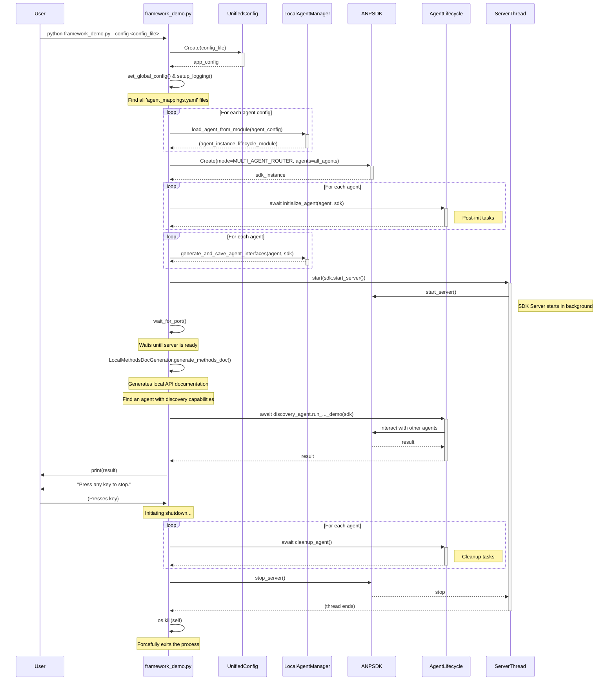

# ANP Open SDK

ANP Open SDK 是一个功能强大的工具包，旨在帮助开发者快速构建、部署和管理基于 ANP (Agent Network Protocol) 核心协议的去中心化智能体网络。它提供了从底层协议到高层插件式框架的分层架构，极大简化了智能体网络的开发流程。

## 🚀 核心目标

**ANP Open SDK 的核心目标是让智能体网络开发者可以快速、高效地搭建基于 `agent_connect` 核心协议的 ANP 智能体网络**，推动由可互操作、智能化、去中心化 Agent 组成的生态繁荣。

## 🏗️ 功能结构

本 SDK 主要由三个层次组成，每一层都提供了不同级别的抽象，以满足不同的开发需求：

### 1. `anp_open_sdk`（核心SDK）

- **协议封装**：完整封装了 ANP 核心协议 `agent_connect`，让智能体之间的通信变得简单透明。
- **DID 用户管理**：支持快速创建和管理 DID (Decentralized Identifier) 用户，用于安全的 API 调用和消息发送。
- **LLM 驱动的智能体**：内置工具，可快速创建由大语言模型 (LLM) 驱动的智能爬虫或其他类型的智能体。
- **FastAPI 服务集成**：可轻松创建多 DID 用户服务，并通过 FastAPI 框架发布信息和 API 接口。
- **身份认证中间件**：提供开箱即用的身份认证中间件，便于服务快速集成认证与访问控制。

### 2. `anp_open_sdk_framework`（高级框架）

- **插件式架构**：以“配置文件 + Python 包”的形式，快速插件式开发和发布 Agent。
- **混合服务能力**：Agent 可同时发布 API 接口和 LLM 服务。
- **灵活部署**：API 和服务可选择发布到网络或仅供本地调用，方便调试和私有化部署。

### 3. `anp_user_extension` / `anp_user_service`（用户端示例）

- **Chrome 插件客户端**：提供 Chrome 插件作为用户端示例。
- **配套后端服务**：包含简单后端服务，支持前端插件运行。
- **快速开发起点**：开发者可基于此示例，快速开发自己的 ANP 用户扩展应用并发布到网络。

---

## ⚡ 快速上手

按照以下步骤，你可以在几分钟内启动并运行你的第一个 ANP 智能体网络。

### 1. 配置环境

复制环境配置文件模板，并填写你的个人配置：

```bash
cp .env.example .env
```

编辑 `.env` 文件，填写你的 `OPENAI_API_KEY`、`OPENAI_API_MODEL_NAME` 和 `OPENAI_API_BASE_URL`。

### 2. 安装依赖

建议使用 Python 虚拟环境管理依赖：

```bash
python -m venv .venv
source .venv/bin/activate 
poetry install
python -m ensurepip --upgrade  
python -m pip install --upgrade pip
ensurepip install agent_connect   
```

windows下可能需要手动添加根目录才能正确找到包地址

```
   $env:PYTHONPATH += ";d:\seanwork\anp-open-sdk"

```

### 3. 运行 SDK 测试和 Demo

运行单元测试和官方 Demo，验证核心 SDK 是否安装并能正常工作：

```bash
python test/test_anpsdk_all.py
python anp_open_sdk_demo/anp_demo_main.py
```

### 4. 体验完整的智能体网络

启动由多个 Agent 插件组成的完整智能体网络：

```bash
# 检查所有 Agent 插件的 DID 是否绑定，未绑定可新建 DID
python anp_open_sdk_framework_demo/agent_user_binding.py
# 启动智能体网络测试
python anp_open_sdk_framework_demo/framework_demo.py
```

逐个调试main函数中如下代码，体验插件Agent调用其他插件Agent的web服务和本地api的方法

```python
    if discovery_agent:
        logger.info(f"✅ Found discovery agent: '{discovery_agent.name}'. Starting its discovery task...")
        # 直接调用 agent 实例上的方法
        publisher_url = "http://localhost:9527/publisher/agents"
        # agent中的自动抓取函数，自动从主地址搜寻所有did/ad/yaml文档
        result = await discovery_agent.discover_and_describe_agents(publisher_url)
        # agent中的联网调用函数，调用计算器
        result = await discovery_agent.run_calculator_add_demo()
        # agent中的联网调用函数，相当于发送消息
        result = await discovery_agent.run_hello_demo()
        # agent中的AI联网爬取函数，从一个did地址开始爬取
        result = await discovery_agent.run_ai_crawler_demo()
        # agent中的AI联网爬取函数，从多个did汇总地址开始爬取
        result = await discovery_agent.run_ai_root_crawler_demo()
        # agent中的本地api去调用另一个agent的本地api
        result = await discovery_agent.run_agent_002_demo(sdk)
        print(result)
        # agent中的本地api通过搜索本地api注册表去调用另一个agent的本地api
        result = await discovery_agent.run_agent_002_demo_new()
        print(result)
```

9527服务器不关闭时,启动9528服务器

```bash
# 检查所有 Agent 插件的 DID 是否绑定，未绑定可新建 DID
python anp_open_sdk_framework_demo/agent_user_binding.py --config unified_config_anp_open_sdk_framework_demo_agent_9528.yaml
# 启动智能体网络测试
python anp_open_sdk_framework_demo/framework_demo.py --config unified_config_anp_open_sdk_framework_demo_agent_9528.yaml
```

注意观察run_ai_root_crawler_demo 的爬取仍然指向9527服务器,跨服通过did认证后爬取服务

```python
   async def run_ai_root_crawler_demo():
      crawler = ANPToolCrawler()
      initial_url = "http://localhost:9527/publisher/agents"
      target_did= "did:wba:localhost%3A9527:wba:user:28cddee0fade0258"
      # 协作智能体通过爬虫向组装后的智能体请求服务
      task_description = "我需要计算两个浮点数相加 3.88888+999933.4445556"
```

### 5. 深入了解结构

ANP Open SDK Framework Demo - 运行流程图



---

## 🔧 二次开发推荐

1. **复制配置文件**
   从 `anp_open_sdk_framework_demo_agent_unified_config.yaml` 复制一份，作为你的智能体网络定义文件。
2. **修改主服务入口**
   直接修改 `framework_demo.py`，或复制一份作为你的 ANP Agent 插件主服务启动脚本。
3. **在插件中添加你的业务逻辑**
   修改 `data_user/localhost_9527/agents_config/` 目录下的插件，加入自己的 API 和 LLM 服务。

通过以上方式，你可以快速将自己的业务逻辑集成到 ANP 智能体网络中，打造属于你的智能体生态。
