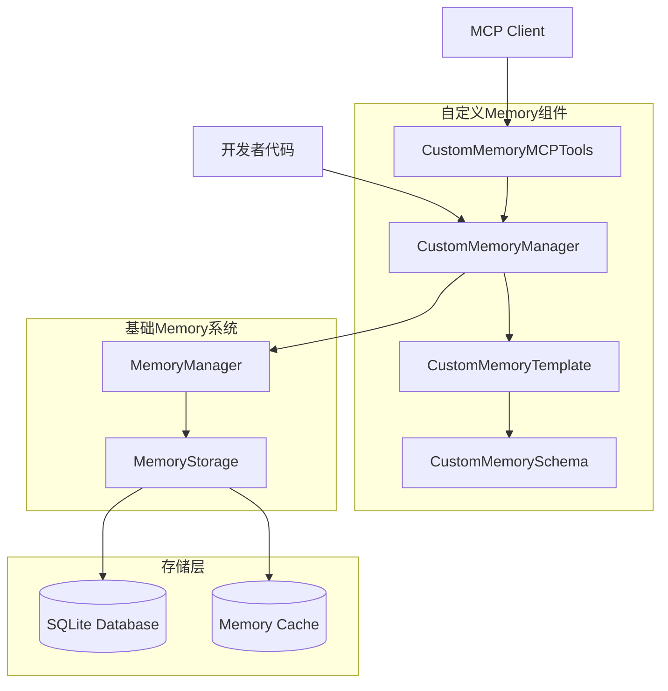

# 自定义Memory快速开始指南

## 概述

这是ANP Open SDK Python版本自定义Memory管理系统的快速开始指南。通过这个指南，开发者可以快速了解如何使用自定义Memory功能，包括创建模板、管理记忆和集成MCP工具。

## 系统架构



## 核心概念

### 1. 自定义记忆模式 (CustomMemorySchema)
定义记忆数据的结构和验证规则

### 2. 自定义记忆模板 (CustomMemoryTemplate)
基于模式创建的可重用模板

### 3. 自定义记忆管理器 (CustomMemoryManager)
提供CRUD操作的主要接口

### 4. MCP工具 (CustomMemoryMCPTools)
标准化的MCP工具接口

## 快速开始

### 步骤1: 初始化管理器

```python
from anp_runtime.local_service.memory import CustomMemoryManager

# 创建自定义记忆管理器
custom_manager = CustomMemoryManager()
```

### 步骤2: 创建记忆模式

```python
from anp_runtime.local_service.memory import CustomMemorySchema

# 定义用户档案模式
user_schema = CustomMemorySchema(
    name="user_profile",
    version="1.0",
    description="用户档案信息",
    fields={
        "name": {"type": str, "description": "用户姓名"},
        "email": {"type": str, "description": "用户邮箱"},
        "preferences": {"type": dict, "description": "用户偏好"}
    },
    required_fields=["name", "email"]
)
```

### 步骤3: 创建记忆模板

```python
# 创建用户档案模板
user_template = await custom_manager.create_template(
    name="user_profile_template",
    schema=user_schema,
    description="用户档案记忆模板",
    default_tags=["user", "profile"],
    default_keywords=["用户信息", "档案"]
)

print(f"模板创建成功: {user_template.id}")
```

### 步骤4: 创建自定义记忆

```python
# 创建用户档案记忆
user_memory = await custom_manager.create_custom_memory(
    template_id=user_template.id,
    content={
        "name": "张三",
        "email": "zhangsan@example.com",
        "preferences": {
            "language": "zh-CN",
            "theme": "dark"
        }
    },
    source_agent_did="did:anp:user_agent",
    source_agent_name="UserAgent",
    title="用户张三的档案"
)

print(f"记忆创建成功: {user_memory.id}")
```

### 步骤5: 查询和更新记忆

```python
# 获取记忆
memory = await custom_manager.get_custom_memory(user_memory.id)
print(f"获取记忆: {memory.title}")

# 更新记忆
await custom_manager.update_custom_memory(
    memory_id=user_memory.id,
    content={
        "name": "张三",
        "email": "zhangsan@newmail.com",  # 更新邮箱
        "preferences": {
            "language": "zh-CN",
            "theme": "light"  # 更新主题
        }
    }
)

# 搜索记忆
memories = await custom_manager.search_custom_memories(
    template_name="user_profile_template"
)
print(f"找到 {len(memories)} 条用户档案记忆")
```

## 常用模板示例

### 1. 任务管理模板

```python
# 任务管理模式
task_schema = CustomMemorySchema(
    name="task_management",
    fields={
        "task_name": {"type": str, "description": "任务名称"},
        "status": {"type": str, "description": "任务状态"},
        "priority": {"type": int, "description": "优先级(1-5)"},
        "assignee": {"type": str, "description": "负责人"},
        "due_date": {"type": str, "description": "截止日期"},
        "progress": {"type": float, "description": "完成进度(0-1)"}
    },
    required_fields=["task_name", "status", "priority"]
)

# 创建任务模板
task_template = await custom_manager.create_template(
    name="task_template",
    schema=task_schema,
    default_tags=["task", "project"],
    default_keywords=["任务", "项目管理"]
)
```

### 2. 知识库模板

```python
# 知识库模式
knowledge_schema = CustomMemorySchema(
    name="knowledge_base",
    fields={
        "title": {"type": str, "description": "知识标题"},
        "category": {"type": str, "description": "知识分类"},
        "content": {"type": str, "description": "知识内容"},
        "source": {"type": str, "description": "知识来源"},
        "confidence": {"type": float, "description": "可信度(0-1)"},
        "references": {"type": list, "description": "参考链接"}
    },
    required_fields=["title", "category", "content"]
)

# 创建知识库模板
kb_template = await custom_manager.create_template(
    name="knowledge_template",
    schema=knowledge_schema,
    default_tags=["knowledge", "reference"],
    default_keywords=["知识", "参考资料"]
)
```

### 3. 对话历史模板

```python
# 对话历史模式
conversation_schema = CustomMemorySchema(
    name="conversation_history",
    fields={
        "session_id": {"type": str, "description": "会话ID"},
        "participants": {"type": list, "description": "参与者列表"},
        "messages": {"type": list, "description": "消息列表"},
        "topic": {"type": str, "description": "对话主题"},
        "sentiment": {"type": str, "description": "情感倾向"},
        "summary": {"type": str, "description": "对话摘要"}
    },
    required_fields=["session_id", "participants", "messages"]
)

# 创建对话历史模板
conv_template = await custom_manager.create_template(
    name="conversation_template",
    schema=conversation_schema,
    default_tags=["conversation", "history"],
    default_keywords=["对话", "历史记录"]
)
```

## MCP工具使用

### 初始化MCP工具

```python
from anp_runtime.local_service.memory import CustomMemoryMCPTools

# 初始化MCP工具
mcp_tools = CustomMemoryMCPTools(custom_manager)
```

### 通过MCP创建模板

```python
# 使用MCP工具创建模板
result = await mcp_tools.create_memory_template(
    name="event_template",
    schema_definition={
        "fields": {
            "event_name": {"type": "str", "description": "事件名称"},
            "event_type": {"type": "str", "description": "事件类型"},
            "timestamp": {"type": "str", "description": "事件时间"},
            "data": {"type": "dict", "description": "事件数据"}
        },
        "required_fields": ["event_name", "event_type", "timestamp"]
    },
    description="系统事件记忆模板",
    default_tags=["event", "system"],
    default_keywords=["事件", "系统日志"]
)

if result["success"]:
    print(f"MCP模板创建成功: {result['template_id']}")
```

### 通过MCP创建记忆

```python
# 使用MCP工具创建记忆
memory_result = await mcp_tools.create_custom_memory(
    template_id=result["template_id"],
    content={
        "event_name": "用户登录",
        "event_type": "authentication",
        "timestamp": "2024-01-15T10:30:00Z",
        "data": {
            "user_id": "user123",
            "ip_address": "192.168.1.100",
            "user_agent": "Mozilla/5.0..."
        }
    },
    source_agent_did="did:anp:system",
    source_agent_name="SystemAgent",
    title="用户登录事件"
)

print(f"MCP记忆创建结果: {memory_result}")
```

## 在装饰器中使用

### 集成到local_method装饰器

```python
from anp_runtime.local_service.local_methods_decorators import local_method
from anp_runtime.local_service.memory import memory_enabled, CustomMemoryManager

@local_method(memory=memory_enabled(tags=["user_operation"]))
async def create_user_account(user_info: dict):
    """创建用户账户并保存档案记忆"""
    
    # 执行用户创建逻辑
    user_id = create_user_in_database(user_info)
    
    # 保存用户档案为自定义记忆
    custom_manager = CustomMemoryManager()
    
    # 查找用户档案模板
    templates = await custom_manager.list_templates()
    user_template = next(
        (t for t in templates if t.name == "user_profile_template"), 
        None
    )
    
    if user_template:
        await custom_manager.create_custom_memory(
            template_id=user_template.id,
            content=user_info,
            source_agent_did="did:anp:user_service",
            source_agent_name="UserService",
            title=f"用户档案-{user_info.get('name', user_id)}"
        )
    
    return {"user_id": user_id, "status": "created"}
```

## 最佳实践

### 1. 模式设计

```python
# 好的模式设计示例
good_schema = CustomMemorySchema(
    name="order_management",
    version="1.0",
    description="订单管理记忆模式",
    fields={
        "order_id": {"type": str, "description": "订单ID", "format": "uuid"},
        "customer_id": {"type": str, "description": "客户ID"},
        "status": {"type": str, "description": "订单状态"},
        "items": {"type": list, "description": "订单商品列表"},
        "total_amount": {"type": float, "description": "订单总金额"},
        "created_at": {"type": str, "description": "创建时间", "format": "datetime"},
        "updated_at": {"type": str, "description": "更新时间", "format": "datetime"}
    },
    required_fields=["order_id", "customer_id", "status", "total_amount"],
    validation_rules={
        "status": {"enum": ["pending", "confirmed", "shipped", "delivered", "cancelled"]},
        "total_amount": {"min": 0}
    }
)
```

### 2. 批量操作

```python
# 批量创建记忆
user_data_list = [
    {"name": "用户1", "email": "user1@example.com"},
    {"name": "用户2", "email": "user2@example.com"},
    {"name": "用户3", "email": "user3@example.com"}
]

memories = await custom_manager.create_custom_memories_batch(
    template_id=user_template.id,
    contents=user_data_list,
    source_agent_did="did:anp:batch_service",
    source_agent_name="BatchService"
)

print(f"批量创建了 {len(memories)} 条记忆")
```

### 3. 搜索和过滤

```python
# 复杂搜索示例
memories = await custom_manager.search_custom_memories(
    template_name="user_profile_template",
    content_query={
        "preferences": {
            "language": "zh-CN"
        }
    },
    tags=["user", "profile"]
)

# 按时间范围搜索
from datetime import datetime, timedelta

recent_memories = await custom_manager.base_manager.search_memories(
    memory_type=MemoryType.PATTERN,
    time_range=(
        datetime.now() - timedelta(days=7),
        datetime.now()
    ),
    limit=50
)
```

### 4. 错误处理

```python
try:
    # 创建记忆
    memory = await custom_manager.create_custom_memory(
        template_id=template_id,
        content=content,
        source_agent_did=agent_did,
        source_agent_name=agent_name
    )
    
except ValueError as e:
    # 数据验证错误
    print(f"数据验证失败: {e}")
    
except RuntimeError as e:
    # 存储错误
    print(f"存储操作失败: {e}")
    
except Exception as e:
    # 其他错误
    print(f"未知错误: {e}")
```

## 监控和统计

### 获取统计信息

```python
# 获取统计信息
stats = await custom_manager.get_custom_memory_statistics()

print(f"""
自定义记忆统计:
- 总模板数: {stats['total_templates']}
- 总模式数: {stats['total_schemas']}
- 总记忆数: {stats['total_custom_memories']}
- 模板使用情况: {stats['template_usage']}
- 模式使用情况: {stats['schema_usage']}
""")
```

### 性能监控

```python
import time
from functools import wraps

def monitor_performance(func):
    """性能监控装饰器"""
    @wraps(func)
    async def wrapper(*args, **kwargs):
        start_time = time.time()
        result = await func(*args, **kwargs)
        end_time = time.time()
        
        print(f"{func.__name__} 执行时间: {end_time - start_time:.2f}秒")
        return result
    return wrapper

# 使用示例
@monitor_performance
async def create_user_memory(user_data):
    return await custom_manager.create_custom_memory(...)
```

## 故障排除

### 常见问题

1. **模板不存在错误**
```python
# 检查模板是否存在
template = await custom_manager.get_template(template_id)
if not template:
    print(f"模板 {template_id} 不存在")
    # 重新创建模板或使用其他模板
```

2. **数据验证失败**
```python
# 先验证数据再创建记忆
is_valid, errors = schema.validate_data(content)
if not is_valid:
    print(f"数据验证失败: {errors}")
    # 修正数据后重试
```

3. **存储空间不足**
```python
# 清理过期记忆
await custom_manager.base_manager.cleanup_memories()

# 获取存储统计
storage_stats = await custom_manager.base_manager.storage.get_storage_stats()
print(f"数据库大小: {storage_stats.get('database_size_bytes', 0)} 字节")
```

## 总结

这个快速开始指南涵盖了自定义Memory系统的核心功能和使用方法。开发者可以根据自己的需求：

1. **创建合适的记忆模式和模板**
2. **使用CRUD操作管理自定义记忆**
3. **通过MCP工具标准化接口**
4. **集成到现有的装饰器系统**
5. **监控和优化性能**

更详细的技术细节请参考完整的设计方案文档。